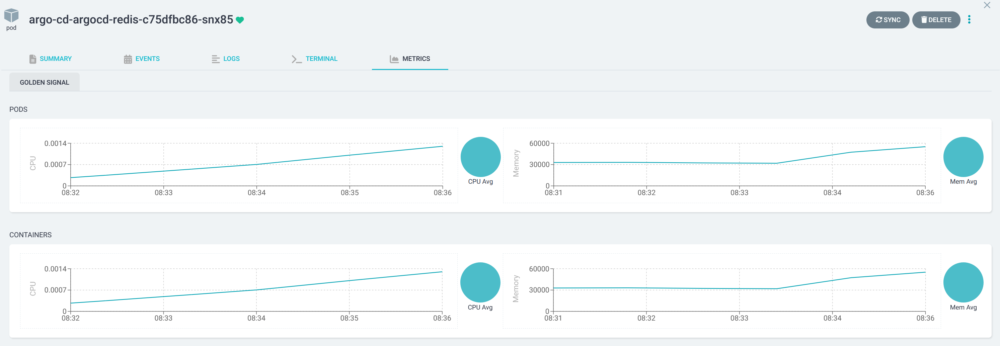

# Argo CD Metrics Extension

This small demo project shows how to integrate Prometheus Metrics into the Argo CD UI.

## Start a Minikube Cluster (optional)

```bash
./00-start-minikube.sh
```

## Install Prometheus

```bash
./01-install-prometheus.sh
```

## Install the Argo CD Metrics Server

```bash
./02-install-argo-cd-metrics-server.sh
```

## Install Argo CD

```bash
./03-install-argo-cd.sh
```

This step also outputs the login credentials for the Argo CD UI. If you have missed them you can run:

```bash
./03a-get-admin-password.sh
```

## Create Argo CD Resources

```bash
./04-create-argo-cd-apps.sh
```

## Access Argo CD UI

```bash
minikube tunnel
```

Open https://argocd.127.0.0.1.nip.io in your Browser. When you click on any Pod or Deployment you should see the Metrics displayed:


